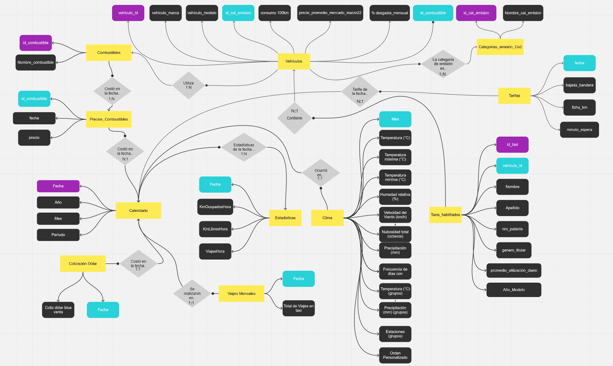
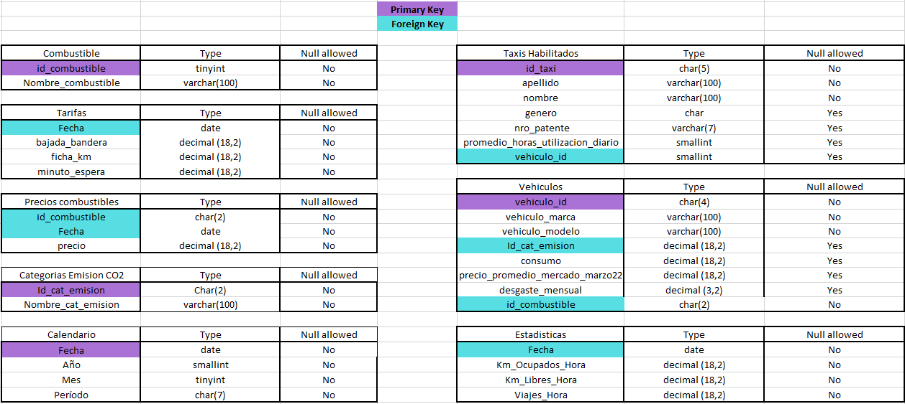

# Rosario Taxi Service Analysis
This is our graduation project for CoderHouse, our **team**decided to make a visual report over the Taxi Service in the city of Rosario, Santa Fe, Argentina. It gives the reader a general perspective about the service statistics, including themes like usability and rentability.

It was indeed a great project to learn from. Both technical and **soft skills** were developed since a lot of teamwork was required. 
This readme resumes the project and the experience behind it, however, full documentation can be found here (Spanish)

Warning! - The visuals are in Spanish

## Our Teamwork
Before I show you our work, I'll show you **how** we worked.

We were a team of three, everyone from different places and working remotely on the same project.
The first thing we did when we were assigned was to create a WhatsApp group, encouraging inmediate communication in an agile way. Furthermore, we quickly scheduled a virtual meeting to introduce ourselves and meet the others.

## The data
A total of five differentes data sources were used in this project. Every one being from official sources like the Rosario government or the Argentina governmet. 
The data was carefously cleaned, procesed and linked using both Excel and SQL to give shape to a clean dataset in which we could work safely.

Here Is the resultant entity relationship diagram

And this is a list of tables along with their columns and datatypes

## General Structure
Brand colors and icons were used to represent a for-and-from CoderHouse report. A simple but effective distribution of four light colored visual graphs on the center-right alongside selection indicators on the left and dark filters on the same column was used for an aesthetically pleasing report with no visual clutter (seriously, it was too much bright until I came up with the idea of the dark filters). Navigation icons were selected according to the aesthetic and thematic of the project.
